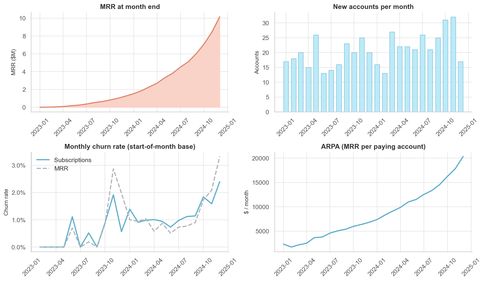
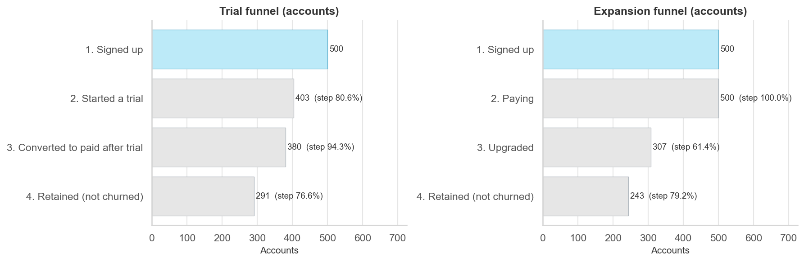
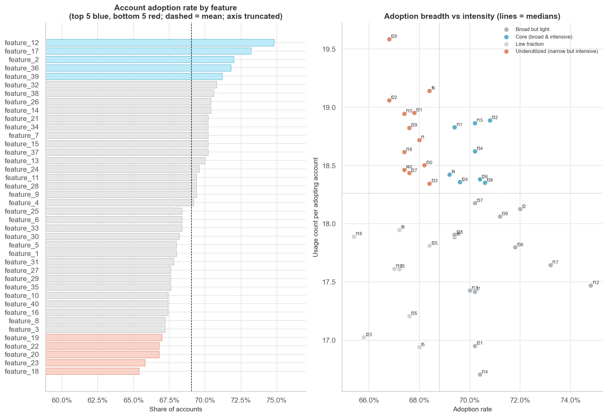
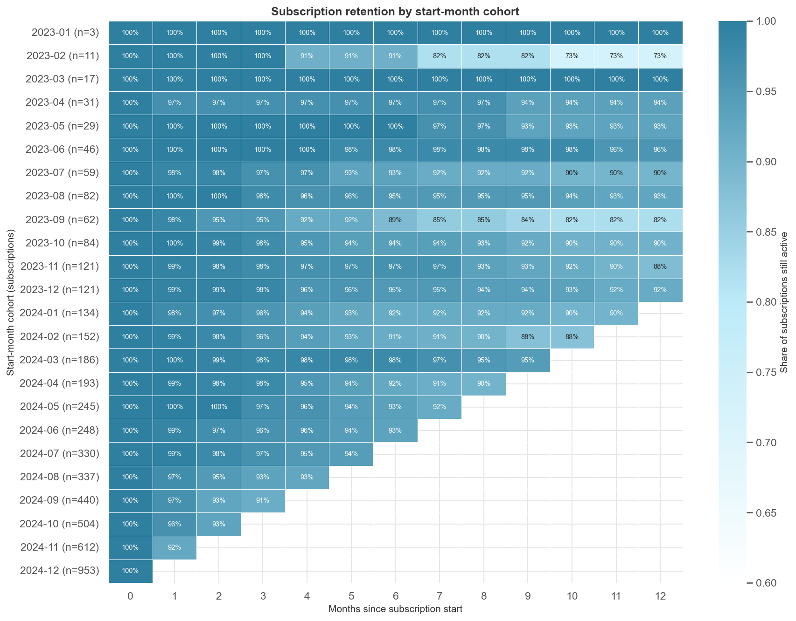
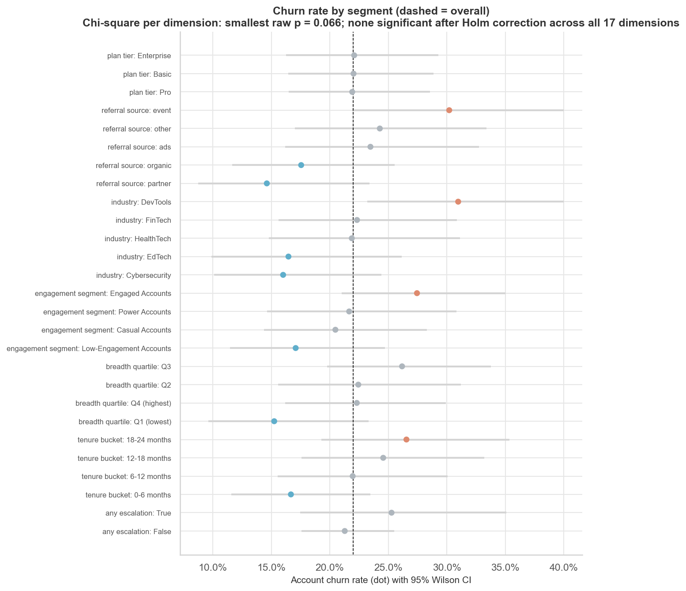
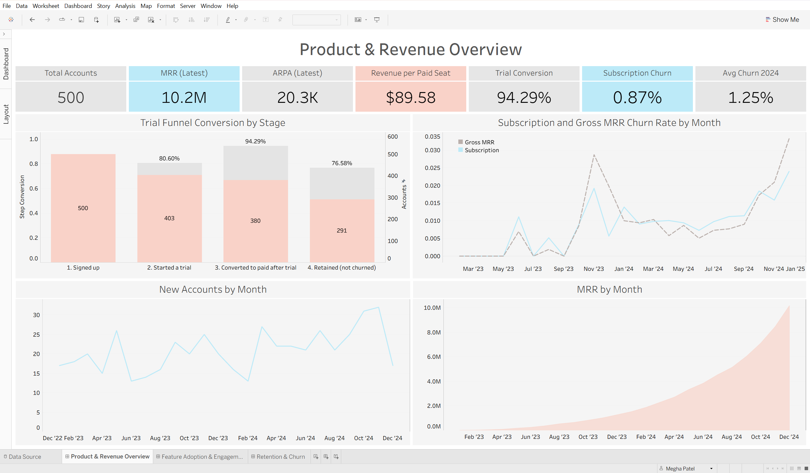
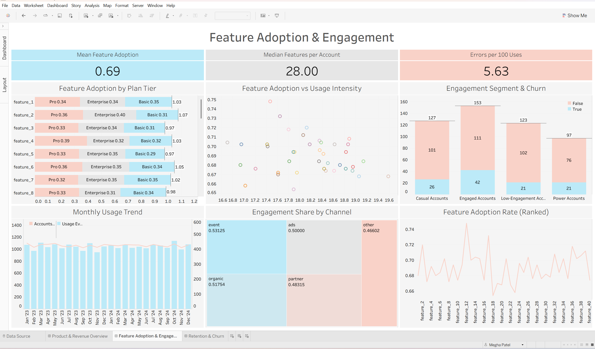
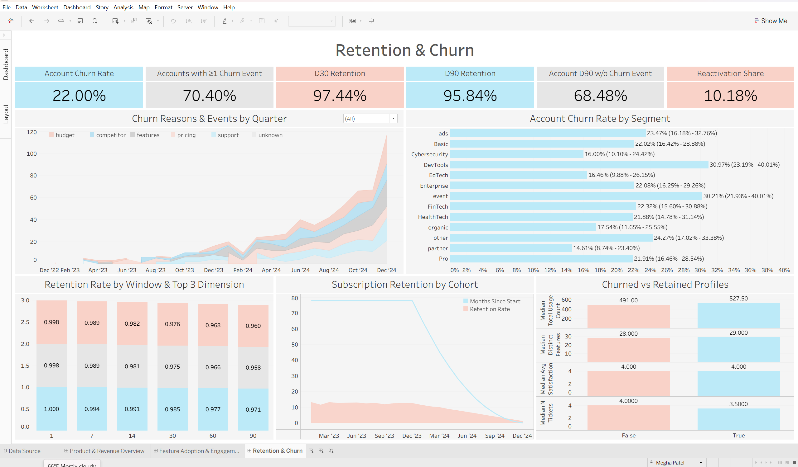

# SaaS Product Intelligence & Growth Analytics

An end-to-end **product analytics case study** on the RavenStack multi-table SaaS dataset. It covers data-quality auditing, a PostgreSQL data model, SaaS KPIs, funnels, feature adoption, segmentation, cohort retention, churn drivers, statistical testing and a small supporting churn model, and it ends with evidence-backed recommendations and three Tableau dashboards.

> Every figure in this README was computed from the data. All findings are **observational associations**. The dataset contains **no experiment**, so no A/B test result is reported anywhere.

---

## Business Problem

RavenStack is a (fictional) stealth-mode SaaS startup piloting AI team tools before public launch. Leadership needs to know how customers move from trial to paid, which features get used, who churns and why, and where to invest before launch.

## Objectives

1. Map the customer funnel and find the largest drop-off
2. Measure feature adoption and identify under-used features
3. Identify behaviours associated with stronger engagement
4. Compare retention across cohorts, plans and channels
5. Identify patterns associated with churn
6. Evaluate plan and segment performance
7. Turn results into prioritised, actionable recommendations

## Dataset

[RavenStack SaaS Subscription & Churn Analytics dataset](https://www.kaggle.com/datasets/rivalytics/saas-subscription-and-churn-analytics-dataset) by **River @ Rivalytics**. Synthetic, MIT-like licence, credit required. Files are in `dataset/raw/`.

| Table | Rows | Grain |
|---|---:|---|
| accounts | 500 | customer account |
| subscriptions | 5,000 | subscription / billing line item |
| feature_usage | 25,000 | daily feature usage record (40 features) |
| support_tickets | 2,000 | ticket |
| churn_events | 600 | churn episode |

Coverage is 2023-01-01 to 2024-12-31 (snapshot 2024-12-31). There is no user-level table, so the **account** is the unit of analysis. Initial assessment: [docs/DATASET_ASSESSMENT.md](docs/DATASET_ASSESSMENT.md). Full details: [docs/DATA_DICTIONARY.md](docs/DATA_DICTIONARY.md).

## Tech Stack

Python (pandas, NumPy, Matplotlib, Seaborn, SciPy, statsmodels, scikit-learn) · PostgreSQL 18 (psycopg 3) · SQL · Jupyter · Tableau · Git

## Data Architecture

```
dataset/raw/*.csv
   │  src/data/clean.py         typed, validated, dq_* flags (no rows deleted)
   ▼
dataset/processed/*.csv ──────────────────────────────┐
   │  src/data/load_postgres.py (COPY)                │  src/run_analysis.py
   ▼                                                  ▼
PostgreSQL  core.*        tables + PK/FK/CHECK       Python analysis & statistics
            analytics.*   views (account_features,      │
                          KPIs, funnel, retention,       ▼
                          churn) ─ src/data/run_sql.py  outputs/tables · figures · insights
   │                                   │
   └── Tableau data sources            └── validate_sql_vs_python.py (SQL = Python?)
```

**Validation:** all SQL scripts (`sql/01`–`09`) execute on PostgreSQL 18. Every data-quality flag recomputed in SQL matches the Python flag. `validate_sql_vs_python` passes **12 of 12** reconciliation checks: KPIs, funnels, features, segments, retention, cohorts and churn (max absolute difference < 1e-11).

## Data Cleaning

All 33,100 rows were kept. Each anomaly is flagged, logged and handled explicitly ([docs/DATA_QUALITY_REPORT.md](docs/DATA_QUALITY_REPORT.md)).

| Issue found | Handling |
|---|---|
| 21 `usage_id`s reused by different records | Surrogate key `usage_row_id` |
| 76.6% of usage dated before its subscription start; 52.8% before account signup; 53.9% of tickets before signup | Flagged. Usage and tickets used only as lifetime aggregates, so no activation or activity-retention metrics |
| `churn_flag` contradicts `churn_events` for 62.4% of accounts | `churn_flag` = churn status; events = episodes (reasons, timing) |
| All 110 churned accounts still hold active paid subscriptions | Documented; KPIs reported "as recorded" |
| `accounts.plan_tier` matches the first subscription for only 33% of accounts; `upgrade_flag` not tied to tier changes | Used as recorded attributes only |
| 36 tickets with first response slower than resolution; 1 repeated churn event | Flagged and excluded from those metrics |
| Outliers (seats, MRR, duration) | Kept: explained by seat-based pricing ($19/$49/$199 per seat) |

## Product KPIs

Definitions and formulas: [docs/ANALYSIS_PLAN.md](docs/ANALYSIS_PLAN.md).

| KPI | Value | KPI | Value |
|---|---:|---|---:|
| Accounts | 500 | Trial-to-paid conversion | 94.3% |
| MRR (snapshot) | $10,159,608 | Account churn rate | 22.0% |
| ARR | $121,915,296 | Accounts with ≥ 1 churn event | 70.4% |
| ARPA | $20,319 / month | Avg monthly subscription churn (2024) | 1.25% |
| Revenue per paid seat | $89.58 / month | Avg monthly gross MRR churn (2024) | 1.21% |
| Active subscriptions | 4,514 | Subscription D90 retention | 95.8% |
| Mean feature adoption | 69.0% | Escalation rate · CSAT | 4.75% · 3.98 |



MRR grows from $1.26M (Dec 2023) to $10.16M (Dec 2024) because concurrent subscriptions accumulate (9 active per account on average).

## Funnel Analysis

No onboarding or activation events exist and every account pays, so the closest valid funnels are used:

* **Trial:** Signed up 500 → Trial 403 → Converted to paid 380 (**94.3%**) → Not churned 291 (**76.6%**)
* **Expansion:** Signed up 500 → Paying 500 → Upgraded 307 (61.4%) → Not churned 243 (79.2%)

**Largest trial-funnel bottleneck:** after conversion (23.4% drop-off), not trial-to-paid (5.7%).



## Feature Adoption

* Adoption is tightly clustered: **65.4%** (feature_18) to **74.8%** (feature_12) of accounts.
* The largest within-plan gap for any feature is 9 pp.
* Beta and GA usage have the same error rates (0.557 vs 0.565 errors per event).
* 12 features are "narrow but intensive": below-median reach, above-median use per adopter. These are discoverability candidates.



## User Segmentation

Interpretable, rule-based **account** segments using P25/P50/P75 thresholds:

| Segment | Rule | Accounts | Churn |
|---|---|---:|---:|
| Power | usage ≥ 619 and ≥ 32 features | 97 | 21.6% |
| Engaged | usage ≥ 499 | 153 | 27.5% |
| Casual | 373 ≤ usage < 499 | 127 | 20.5% |
| Low-Engagement | usage < 373 | 123 | 17.1% |

K-means was evaluated (best silhouette 0.27) and rejected as adding no value. "Dormant" and "At-Risk" segments were not created because usage recency is unreliable.

## Cohort Retention

* **Subscription retention** (eligible cohorts): D1 99.8% · D7 98.9% · D14 98.1% · D30 97.4% · D60 96.6% · D90 95.8%. The weakest start quarter at D90 is 2024Q3 (93.5%). Plan and channel differences are ≤ 2 pp.
* **Account retention** (no churn event since signup): D30 83.6% · D90 68.5% · D180 56.1% · D365 41.7%.
* Newer signup cohorts look worse, but churn events cluster in late 2024 for **all** cohorts (10.9 → 50.0 events per 100 accounts per quarter). This calendar confound is why no "newer cohorts are worse" claim is made.
* Feature breadth shows no consistent retention gradient.



## Churn Analysis

**Churn Drivers Analysis** (17 dimensions, Wilson CIs, chi-square with Holm correction):
* **Channel:** higher churn among event-sourced accounts (30.2%) than partner (14.6%) and organic (17.5%). Raw p = 0.079; Holm-adjusted p = 0.79 in the 11-test family.
* **Industry:** higher churn among DevTools (31.0%) than Cybersecurity (16.0%). Raw p = 0.066; Holm-adjusted p = 0.72 in the 11-test family.
* (On the churn-drivers chart these dimensions are Holm-adjusted across all 17 dimensions tested, so the adjusted p-value there is higher. Raw p-values are identical.)
* **Plan:** no difference (21.9%–22.1%, p = 0.999).
* **Behaviour** (usage, breadth, errors, tickets, escalations): no reliable association.
* **Reasons:** spread evenly (features 19%, support 17%, budget 17%, unknown 16%, competitor 15%, pricing 15%). Free-text feedback does not match reason codes.



## Statistical Analysis

Eleven pre-specified tests with alpha = 0.05 on Holm-adjusted p-values, each documenting hypotheses, assumptions, statistic, CI, effect size and interpretation ([outputs/insights/statistical_tests.md](outputs/insights/statistical_tests.md)).

| Question | Test | Result |
|---|---|---|
| Churn by plan | Chi-square | V = 0.002, p = 0.999 |
| Churn by channel / industry | Chi-square | V = 0.13 each, Holm p = 0.79 / 0.72 |
| High vs low engagement churn | Two-proportion z | 25.2% vs 18.8%, CI −0.9 to 13.6 pp, Holm p = 0.79 |
| Engagement vs time to first churn | Log-rank | p = 0.33 |
| Feature breadth vs churn | Two-proportion z | 24.3% vs 18.9%, CI −2.0 to 12.5 pp |
| Usage: churned vs retained | Mann-Whitney U | r = −0.08, p = 0.21 |
| Subscription survival by plan | Log-rank | p = 0.77 |
| Escalation vs churn | Fisher exact | OR 1.25 (0.74–2.12) |
| Beta vs GA errors | Mann-Whitney U | r = 0.003, p = 0.74 |
| Resolution time by ticket priority | Kruskal-Wallis H | H = 3.41, ε² = 0.002, p = 0.33 |

**No hypothesis is rejected.** With n = 500, this means no reliable evidence of the effects, not proof that none exist.

**Supporting churn model:** logistic regression and random forest reach cross-validated ROC-AUC of 0.52 and 0.53, vs 0.50 for a dummy baseline. Behavioural features do not separate churners, and the model is not used for decisions. *Prediction is not causation.*

**A/B testing:** the data has no experiment, variant or exposure fields, so none is claimed. A clearly labelled **hypothetical** onboarding experiment with power calculations is in [docs/EXPERIMENT_DESIGN.md](docs/EXPERIMENT_DESIGN.md). For example, detecting a 10 pp drop in 90-day churn events needs 608 accounts, about 27 months of current signups.

## Tableau Dashboards

Three dashboards built on the validated extracts, in [tableau/SaaS Project.twb](tableau/): **Product & Revenue Overview**, **Feature Adoption & Engagement**, and **Retention & Churn**. Sheet-by-sheet documentation is in [tableau/README.md](tableau/README.md); every measure is listed in [tableau/calculated_fields.md](tableau/calculated_fields.md).

**1 · Product & Revenue Overview** — revenue trend, acquisition, churn velocity and the trial funnel.



**2 · Feature Adoption & Engagement** — adoption by feature and plan, engagement segments and usage trend.



**3 · Retention & Churn** — cohort retention, churn by segment with confidence intervals, and churn reasons.



Every KPI tile matches `outputs/tables/headline_kpis.csv` — the dashboards, the Python pipeline and the SQL views all report the same numbers.

## Key Business Insights

Full evidence: [docs/BUSINESS_INSIGHTS.md](docs/BUSINESS_INSIGHTS.md).

1. **Conversion is solved; retention is not.** 94.3% trial-to-paid, but a 23.4% drop-off after conversion.
2. **Enterprise = 74.3% of MRR** from 34% of subscriptions, with the same churn rate as other plans.
3. **Usage volume does not identify churn risk.** Engagement, breadth and ML all perform at or near chance.
4. **Directional channel and industry gaps** (event 30.2%, DevTools 31.0%) are not significant yet.
5. **Support resolution ignores priority.** Urgent tickets take a mean 34.6 h vs 36.3 h for low (Kruskal-Wallis p = 0.33: no evidence of faster handling). CSAT never records scores below 3.
6. **Instrumentation is unreliable.** The two churn sources conflict for 62.4% of accounts, and churned accounts hold $2.07M of MRR.

## Recommendations

1. Establish one churn event of record and enforce event timestamps before scaling retention programmes.
2. Shift growth effort to post-conversion onboarding, validated by a randomised test after launch.
3. Protect Enterprise revenue: named account management and MRR-based retention KPIs.
4. Introduce priority-based support SLAs and a CSAT survey that can capture dissatisfaction.
5. Monitor channel and industry churn before reallocating acquisition spend.
6. Test discoverability for narrow-but-intensive features; hold off on usage-based health scores.

## Project Structure

```
├── dataset/
│   ├── raw/                    RavenStack CSVs + source README
│   └── processed/              cleaned tables + account_features (generated)
├── notebooks/
│   ├── 01_data_exploration.ipynb
│   ├── 02_data_cleaning.ipynb
│   ├── 03_product_analytics.ipynb
│   └── 04_statistical_analysis.ipynb
├── src/
│   ├── data/                   clean.py · load_postgres.py · run_sql.py · validate_sql_vs_python.py
│   ├── analysis/               marts · kpis · funnel · feature_adoption · segmentation · retention · churn
│   ├── statistics/             hypothesis_tests · churn_model · experiment_design
│   ├── utils/                  config · io · db · plotting
│   └── run_analysis.py         full Python pipeline
├── sql/                        01_schema … 09_business_insights
├── tableau/                    SaaS Project.twb · README.md · calculated_fields.md · screenshots/
├── outputs/
│   ├── figures/                13 charts
│   ├── tables/                 analysis tables · sql/ (SQL results) · tableau/ (extracts)
│   └── insights/               key_metrics.json · statistical_tests.md
├── docs/                       DATASET_ASSESSMENT · DATA_DICTIONARY · DATA_QUALITY_REPORT · ANALYSIS_PLAN · BUSINESS_INSIGHTS · EXPERIMENT_DESIGN
├── requirements.txt · .env.example · .gitignore
```

## How to Run

```bash
# 1. Environment
python -m venv .venv
.venv\Scripts\activate            # macOS/Linux: source .venv/bin/activate
pip install -r requirements.txt

# 2. Clean data  (dataset/raw -> dataset/processed)
python -m src.data.clean

# 3. Python analysis  (-> outputs/)
python -m src.run_analysis

# 4. PostgreSQL: copy .env.example to .env and fill in PGHOST/PGPORT/PGUSER/PGPASSWORD/PGDATABASE
python -m src.data.load_postgres        # creates DB, schema, loads core.* tables

# 5. SQL analysis + reconciliation with Python
python -m src.data.run_sql              # runs sql/02-09, exports outputs/tables/sql/
python -m src.data.validate_sql_vs_python

# 6. Notebooks
jupyter nbconvert --to notebook --execute --inplace notebooks/*.ipynb
```

**7. Tableau:** open `tableau/SaaS Project.twb`, or rebuild from `outputs/tables/tableau/*.csv` or the PostgreSQL `analytics.*` views, following [tableau/README.md](tableau/README.md). Credentials are only ever read from environment variables or `.env` (gitignored); none are stored in code.

## Limitations

* **Synthetic data.** Tables appear to have been generated largely independently, so many real-world relationships are absent and the results show method, not RavenStack truth.
* Usage and ticket dates are not lifecycle-aligned, so activation, time-to-value and activity retention are unavailable.
* Churn labels conflict. Account churn uses `churn_flag`; conclusions could differ with the event-based definition.
* MRR sums concurrent subscription line items and includes accounts flagged as churned.
* n = 500 accounts limits power for small effects. Calendar concentration of churn events confounds cohort comparisons.
* Everything is observational: no causal claims and no A/B test.

## Future Improvements

* Rebuild on production data with reliable event timestamps and a single churn source.
* Add user-level events (sessions, onboarding milestones) for activation and activity retention.
* Survival models with time-varying covariates once behaviour is time-aligned.
* Run the designed onboarding experiment after launch.
* Point the Tableau workbook at the PostgreSQL views instead of CSV extracts, and schedule the SQL pipeline (e.g. dbt) with automated data-quality tests.

---
*Dataset credit: River @ Rivalytics (RavenStack synthetic SaaS dataset).*
